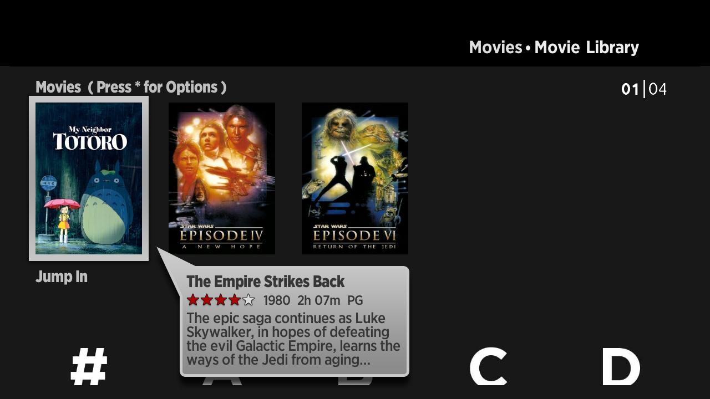
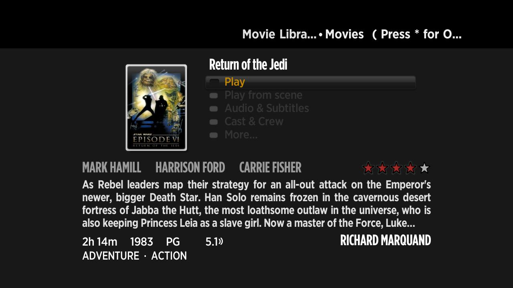

## Jellyfin-Roku

Jellyfin-Roku is a local client for your roku devices allowing you to connect to a local jellyfin server.

Currently Jellyfin-Roku connects you to your server through http.

### Getting Started Developing Jellyfin-Roku

First enable developer mode on your Roku device:

http://sdkdocs.roku.com/display/sdkdoc/Developer+Guide

Then, zip up the source code directory. Visit YOUR-ROKU-IP in your browser, updating the IP address with the IP of the Roku device. From here you can upload the zip to the device. 

### Debugging
To debug, use any telnet client on port 8085 of the Roku. In windows, open a command promt:

telnet YOUR-ROKU-IP 8085

